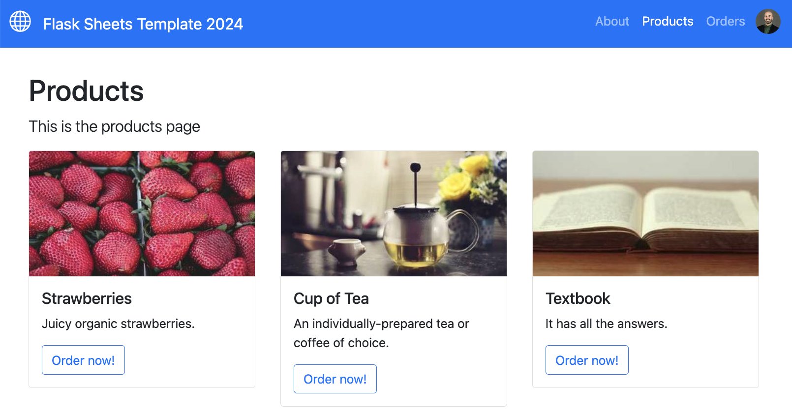

# flask-sheets-template-2024

A web application starter template, created in Python with the Flask framework. Allows users to login with their Google accounts (via OAuth). Interfaces with a Google Sheets database.



## Setup

### Prerequisites

This application requires a Python development environment with the following tools installed:

- Git
- Anaconda (includes Python and Pip)

Beginners can consult the prof's [Python Development Environment Setup Guide](https://github.com/prof-rossetti/intro-to-python/blob/main/exercises/local-dev-setup/README.md#option-b-full-setup) ("Full Setup").


### Repo Setup

From the prof's web application template repository on GitHub, click "Use this template" to create a new copy of this repository under your own control (first time only).

Using GitHub Desktop or the command line, clone your copy of the repo to download it onto your local machine. Observe the location where you downloaded it (for example the Desktop).

Using GitHub Desktop or the command line, navigate to the local repo (for example if on the Desktop):

```sh
cd ~/Desktop/flask-sheets-template-2024
```

> NOTE: it is important to navigate to the root directory before running any of the commands below.


### Virtual Environment Setup

Create new Anaconda virtual environment (first time only):

```sh
conda create -n flask-sheets-2024 python=3.10
```

Activate the virtual environment (first time, or whenever you return to the project):

```sh
conda activate flask-sheets-2024
```

> NOTE: it is important to activate the virual environment before running any of the commands below.

Install package dependencies (first time only):

```sh
pip install -r requirements.txt
```

> NOTE: if you see an error after running this package installation command, make sure you have first navigated to the root directory of your local repository, where the "requirements.txt" file exists.

### Services Setup

This app requires a few services, for user authentication and data storage. Follow the instructions below to setup these services:

1. Follow the [Google Cloud Setup Guide](./docs/GOOGLE_CLOUD.md) to configure a Google Cloud project to facilitate user logins and programmatic access to Google APIs. Obtain and configure client credentials (via environment variables) and service account credentials (via JSON file).

2. Follow the [Google Sheets Database Setup Guide](./docs/GOOGLE_SHEETS.md) to setup the Google Sheets database.

3. If you would like to configure Google Analytics, optionally consult the [Google Analytics Setup Guide](./docs/GOOGLE_ANALYTICS.md).


## Configuration

We will use environment variables to pass secret credentials to the app in a secure, indirect way.

Create a file called ".env" in the root directory of this repository, and add contents like the following (specifying your own credentials, as obtained during the "Setup" section):

```sh
FLASK_APP="web_app"

#
# GOOGLE OAUTH (see Google Cloud Setup Guide):
#
GOOGLE_CLIENT_ID="____________"
GOOGLE_CLIENT_SECRET="____________"

#
# GOOGLE SHEETS DATABASE (see Google Sheets Database Setup Guide)
#
GOOGLE_SHEETS_DOCUMENT_ID="____________"
#GOOGLE_SHEETS_TEST_DOCUMENT_ID="____________"

#
# GOOGLE ANALYTICS (see Google Analytics Setup Guide)
#
#GA_TRACKER_ID="____________"
```


## Usage

### Google Sheets Database

After you have set up the Google Sheets database, you should be able to use the spreadsheet service to interface with it at a low level (for example to list all the sheets in the document):

```sh
python -m app.spreadsheet_service
```

Assuming the "products" sheet has been setup properly, you can use the model class to interface with it at a higher level (for example to populate the sheet with example records):

```sh
python -m app.models.product
```

This should populate the sheet with the following records:

| id  | name         | description                                       | price  | url                                   | created_at |
| --- | ------------ | ------------------------------------------------- | ------ | ------------------------------------- | ---------- |
| 1   | Strawberries | Juicy organic strawberries.                       | 4.99   | https://picsum.photos/id/1080/360/200 | ...        |
| 2   | Cup of Tea   | An individually-prepared tea or coffee of choice. | 3.49   | https://picsum.photos/id/225/360/200  | ...        |
| 3   | Textbook     | It has all the answers.                           | 129.99 | https://picsum.photos/id/24/360/200   | ...        |

> NOTE: see the contents of the ["app/models/product.py"](/app/models/product.py) file for more details, and feel free to customize the `SEEDS` as desired.

### Web Application

Run the local web server (then visit http://localhost:5000 in a browser):

```sh
FLASK_APP=web_app flask run
```

> NOTE: if you run into issues seeting the site at the localhost:5000 address, try 127.0.0.1:5000 instead!


## Testing

We will use a separate Google Sheet "test document" during testing. This keeps development data seprate from test data, and allows for experimentation when testing.

To setup the test document, follow a modified version of the Google Sheets Database Setup Guide:
  1. Create a copy of the Google Sheet "development document" you setup earlier (including the "products" and "orders" sheet with the proper column identifiers).
  2. Share this document with your service account's email address, giving it "Editor" priviges.
  3. Note the document's identifier from the URL bar, and set it as a separate environment variable called `GOOGLE_SHEETS_TEST_DOCUMENT_ID`, by adding this environment variable to the ".env" file.

Running tests, as configured by the "conftest.py" file and defined in the "test" directory:

```sh
pytest
```

> NOTE: the "test/web_app_test.py" file references specific content on certain pages, so as you update the page contents you may need to update the tests as well.

## Continuous Integration

See the [GitHub Actions Setup Guide](/docs/GITHUB_ACTIONS.md) for more information about configuring the Continuous Integration (CI) build process.

## Deploying / Hosting

See the [Deployment Guide](/docs/RENDER.md) for instructions on deploying to a production server hosted by Render.


## [License](/LICENSE.md)
